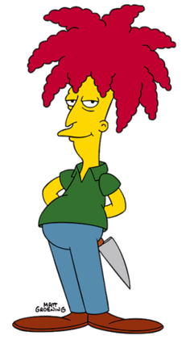
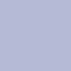

# Aprendizado de máquina

## Classificação de imagens

## Personagens

- Sideshow Bob

    

- Krusty the Clown

    

## Características utilizadas

> As seguintes características foram consideradas, utilizando-se de um range de 10 pontos para menos e para mais, para cada uma das cores (R/G/B)
> Ex: Cabelo do Bob, considerei: R entre 171 e 191; G entre 2 e 22; B entre 34 e 54.

### Bob

- Cabelo vermelho - rgb(181, 12, 44) 
- Calça azul - rgb(83, 139, 171) 
- Camiseta verde - rgb(51, 78, 43) 

### Krusty

- Cabelo verde - rgb(29, 101, 90) 
- Calça verde claro - rgb(180, 213, 140) 
- Camiseta roxa - rgb(181, 186, 214) 

---

## Classificação

### Foram utilizadas 50 imagens aleatórias, entre Bob e Krusty, que podem ser localizadas na pasta python/images.

### Segue abaixo um exemplo de retorno da classificação do algoritmo:

```
Extracting characteristics from krusty (397).jpg
Image received /home/eliasheinzen/aprendizado-maquina/python/images/krusty (397).jpg
Handle width and height
Normalize Features
[0.0, 0.0010067654639175257, 0.0, 0.02818943298969072, 0.0, 0.0, 1.0]
Data added to index 44
Extracted Features:
Bob hair = 0.0
Bob pants = 0.0010067654639175257
Bob shirt = 0.0
Krusty hair = 0.02818943298969072
Krusty pants = 0.0
Krusty shirt = 0.0
Class = Krusty
```


```
Extracting characteristics from bob (256).jpg
Image received /home/eliasheinzen/aprendizado-maquina/python/images/bob (256).jpg
Handle width and height
Normalize Features
[0.0, 0.014429419525065964, 0.0, 0.0, 0.0, 0.0, 0.0]
Data added to index 45
Extracted Features:
Bob hair = 0.0
Bob pants = 0.014429419525065964
Bob shirt = 0.0
Krusty hair = 0.0
Krusty pants = 0.0
Krusty shirt = 0.0
Class = Bob
```

---

## Weka

### A partir do arquivo `caracteristicas.arff` gerado, foi possível executar o algoritmo NaiveBayes dentro da ferramenta Weka, onde obtive os seguintes resultados:

```
=== Run information ===

Scheme:       weka.classifiers.bayes.NaiveBayes 
Relation:     caracteristicas
Instances:    50
Attributes:   7
              bob_hair
              bob_pants
              bob_shirt
              krusty_hair
              krusty_pants
              krusty_shirt
              classe
Test mode:    10-fold cross-validation

=== Classifier model (full training set) ===

Naive Bayes Classifier

                 Class
Attribute          Bob  Krusty
                 (0.5)   (0.5)
===============================
bob_hair
  mean           0.0025  0.0271
  std. dev.      0.0121   0.121
  weight sum         25      25
  precision      0.0617  0.0617

bob_pants
  mean           0.0222  0.0488
  std. dev.      0.0556  0.0841
  weight sum         25      25
  precision      0.0093  0.0093

bob_shirt
  mean           0.0277   0.061
  std. dev.      0.1108  0.1761
  weight sum         25      25
  precision      0.0462  0.0462

krusty_hair
  mean           0.0005  0.0876
  std. dev.      0.0023  0.0839
  weight sum         25      25
  precision      0.0115  0.0115

krusty_pants
  mean            0.002  0.0294
  std. dev.      0.0096  0.1441
  weight sum         25      25
  precision       0.049   0.049

krusty_shirt
  mean           0.0202   0.044
  std. dev.      0.0457  0.1464
  weight sum         25      25
  precision       0.022   0.022


Time taken to build model: 0 seconds

=== Stratified cross-validation ===
=== Summary ===

Correctly Classified Instances          43               86      %
Incorrectly Classified Instances         7               14      %
Kappa statistic                          0.72  
Mean absolute error                      0.1613
Root mean squared error                  0.3811
Relative absolute error                 32.133  %
Root relative squared error             75.8843 %
Total Number of Instances               50     

=== Detailed Accuracy By Class ===

                 TP Rate  FP Rate  Precision  Recall   F-Measure  MCC      ROC Area  PRC Area  Class
                 0.880    0.160    0.846      0.880    0.863      0.721    0.941     0.950     Bob
                 0.840    0.120    0.875      0.840    0.857      0.721    0.902     0.844     Krusty
Weighted Avg.    0.860    0.140    0.861      0.860    0.860      0.721    0.921     0.897     

=== Confusion Matrix ===

  a  b   <-- classified as
 22  3 |  a = Bob
  4 21 |  b = Krusty
```

---

## Conclusão

#### Como podemos ver na Matriz de Confusão acima, das 50 imagens aleatórias do dataset, 25 foram classificadas como Sideshow Bob, e as outras 25 como Krusty the Clown, sendo que:

- Bob: 22 foram corretas (TP), e 3 foram erradas (FP).
- Krusty: 4 foram erradas (FN), e 21 foram corretas (TN).